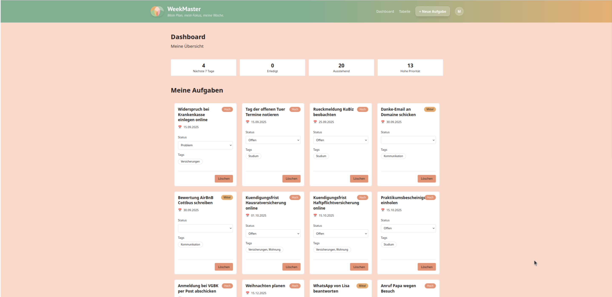
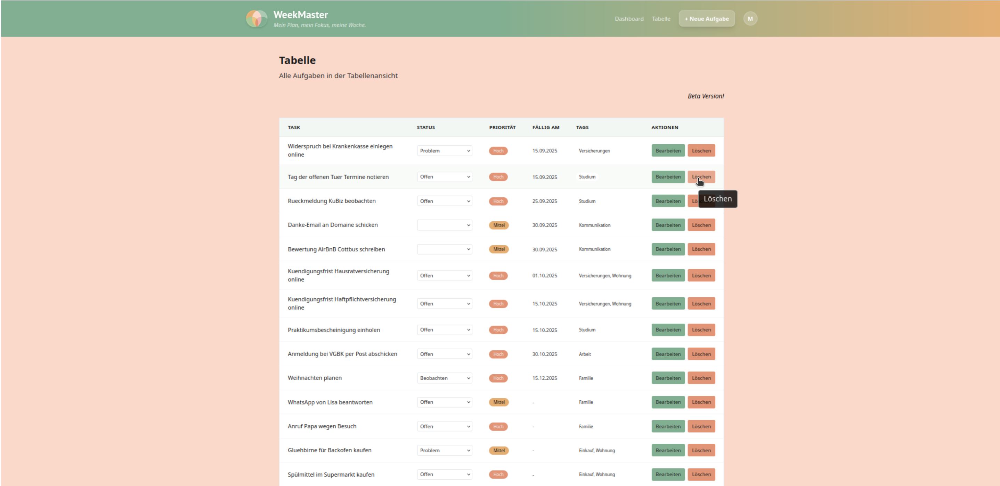
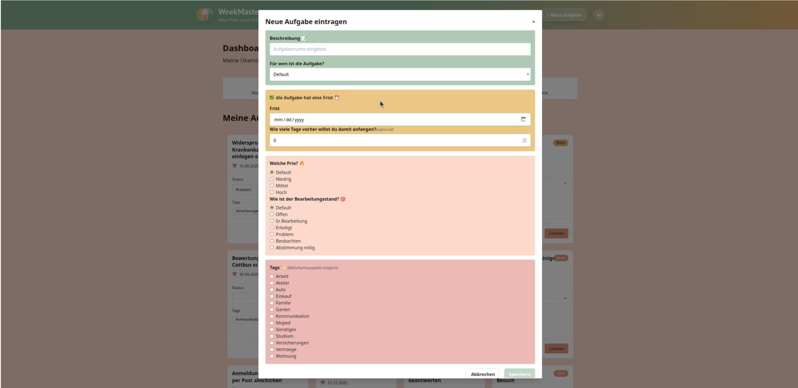
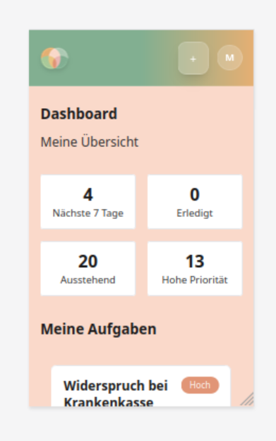
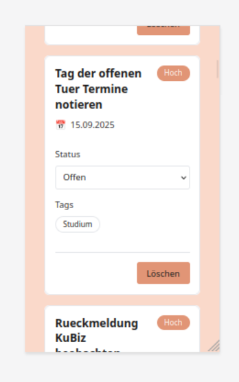
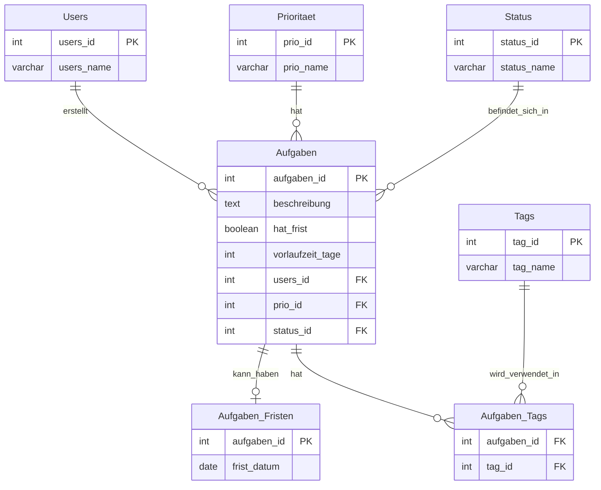

# Willkommen beim WeekMaster 

**Beta Version** - Eine Web-Applikation für intelligente Aufgabenverwaltung mit Angular Frontend und Node.js Backend.


## 📸 Screenshots

### Dashboard-Übersicht
*Zentrale Statistiken und Aufgabenverteilung*



### Tabellen-Ansicht
*Kompakte Listendarstellung aller Aufgaben*



### Task-Dialog
*Neue Aufgabe erstellen mit allen verfügbaren Optionen*



### Dropdown Task-Dialog
*Filter- und Auswahlmöglichkeiten*


### Mobile-Ansicht
*Responsive Design für Smartphones*



### Mobile-Ansicht
*Responsive Design für Smartphones*




## Projektstruktur

```
WeekMaster/
├── frontend/                          # Angular Frontend (Standalone Components)
│   ├── src/
│   │   ├── app/
│   │   │   ├── components/            # **Wiederverwendbare Komponenten**
│   │   │   │   ├── task-card/         # Einzelne Aufgaben-Karte (Grid-Modus)
│   │   │   │   ├── task-dialog/       # Dialogfenster zum Erstellen neuer Aufgaben
│   │   │   │   ├── task-display/      # Vereinheitlichte Task-Anzeige (Grid/Table)
│   │   │   │   └── universal-dialog/  # Wiederverwendbares Dialogfenster
│   │   │   ├── core/                  # **Kern-Layout-Komponenten**
│   │   │   │   ├── header/            # Navigation und App-Header
│   │   │   │   └── footer/            # App-Footer
│   │   │   ├── pages/                 # **Seiten-Komponenten**
│   │   │   │   ├── dashboard/         # Dashboard mit Statistiken
│   │   │   │   └── tables/            # Tabellenansicht der Aufgaben
│   │   │   ├── services/              # **Angular Services**
│   │   │   │   ├── dialog.service.ts  # Einheitliches Dialog-Management
│   │   │   │   └── task.service.ts    # API-Kommunikation & HTTP-Calls
│   │   │   ├── models/                # **TypeScript Interfaces**
│   │   │   │   └── task.model.ts      # Aufgaben-Datenmodell
│   │   │   ├── app.config.ts          # **Angular Anwendungs-Konfiguration**
│   │   │   ├── app.component.*        # **Haupt-App-Komponente (HTML/TS)**
│   │   │   └── app.routes.ts          # **Router-Konfiguration**
│   │   ├── environments/              # **Umgebungs-Konfiguration**
│   │   │   ├── environment.ts         # Development (localhost)
│   │   │   ├── environment.staging.ts # Staging (Vercel)
│   │   │   └── environment.prod.ts    # Production
│   │   ├── index.html                 # **Haupt-HTML-Einstiegspunkt**
│   │   ├── main.ts                    # **Anwendungs-Bootstrap**
│   │   └── styles.css                 # **Globale Tailwind CSS + Custom Classes**
│   ├── public/                        # **Statische Assets**
│   │   └── LogoWeekMaster.ico         # App-Logo
│   ├── angular.json                   # **Angular CLI Konfiguration**
│   ├── tailwind.config.js             # **Tailwind CSS Konfiguration**
│   ├── package.json                   # **Frontend-Abhängigkeiten**
│   └── tsconfig.json                  # **TypeScript-Konfiguration**
│
├── backend/                           # Node.js Backend mit Express
│   ├── routes/                        # **API-Route-Handler**
│   │   ├── dashboard.js               # Dashboard-Auswertungen & Statistiken
│   │   ├── index.js                   # **Haupt-Router-Registrierung**
│   │   ├── priorities.js              # Prioritäten-Stammdaten-API
│   │   ├── status.js                  # Status-Stammdaten-API
│   │   ├── tags.js                    # Tag-CRUD + Suche + Autocomplete
│   │   ├── tasks.js                   # Aufgaben-CRUD + Spezielle Abfragen
│   │   └── users.js                   # Benutzer-Stammdaten-API
│   ├── db.js                          # **PostgreSQL Datenbankverbindung**
│   ├── initdb.js                      # **Datenbank-Initialisierungsskript**
│   ├── server.js                      # **Express-Server-Setup & Middleware**
│   ├── vercel.json                    # **Vercel Deployment-Konfiguration**
│   └── package.json                   # **Backend-Abhängigkeiten**
│
├── docs/                              # **Dokumentation**
│   ├── DATABASE-SCHEMA.sql            # Vollständige Datenbankstruktur + Daten
│   └── TAILWIND-SPICKZETTEL.md        # Tailwind CSS Referenz
│
├── scripts/                           # **Build & Deployment Scripts**
├── package.json                       # **Root-Package (concurrently-Skripte)**
└── README.md                          # **Projekt-Dokumentation**
```

## Technologie-Stack

- **Frontend**: Angular 18+ mit TypeScript (Standalone Components)
- **Backend**: Node.js mit Express
- **Datenbank**: PostgreSQL (HTW Server) 
- **API**: RESTful API mit CORS-Unterstützung
- **Styling**: Tailwind CSS mit Custom Component Classes
- **Deployment**: Vercel (Frontend & Backend)
- **State Management**: RxJS dank DialogService
- **HTTP-Optimierung**: forkJoin für parallele API-Calls

## ER-Diagramm



## Datenbankdesign

Das ER-Diagramm oben zeigt die vollständige Datenbankstruktur. Noch mehr Details findest du in `docs/DATABASE-SCHEMA.sql`.

**Kernkonzepte:**

- **Dashboard-Statistiken**: Überblick über Aufgabenstatus und Prioritäten
- **Responsive Design**: Mobile-First Ansatz mit Tailwind CSS
- **Tag-System**: Kategorisierung von Aufgaben  (im Ausbau)
- **Deadline-Management**: Vorlaufzeit-System für frühzeitige Benachrichtigungen (in Entwicklung)

**Datenbankstruktur:**
- Normalisierte PostgreSQL-Datenbank
- Separate Tabellen für Users, Prioritäten, Status und Tags
- N:N-Beziehungen für flexible Tag-Zuordnung
- Referenzielle Integrität durch Foreign Key Constraints

## Datenbestand

Das System enthält ein Initialskript (`initdb.js`) mit umfangreichen Beispieldaten für eine realistische Demonstration:

- **8 Benutzer** (7 echte + 1 Default-User für schnelle Notizen)
- **4 Prioritätsstufen** (Hoch, Mittel, Niedrig + Default)
- **7 Status-Optionen** (Offen, In Bearbeitung, Erledigt, Problem, Beobachten, Abstimmung nötig + Default)  
- **13 Tag-Kategorien** für Lebens- und Arbeitsbereiche (Wohnung, Familie, Studium, etc.)
- **21 Beispiel-Aufgaben** mit realistischen Fristen und Vorlaufzeiten (0-30 Tage)

Vollständige Daten und SQL-Inserts finden sich in `docs/DATABASE-SCHEMA.sql`. Zur automatischen Initialisierung nutze die HTTP-Route `http://localhost:3000/initdb` bzw. im Deploy https://week-master-api.vercel.app/initdb oder das direkte Script `node backend/initdb.js`.


**Aktuelle Features:**
- ✅ Task-Management (CRUD-Operationen)
- ✅ Dashboard mit Statistiken  
- ✅ Grid- und Tabellenansicht
- ✅ Status- und Prioritätsverwaltung
- ✅ Responsive Design (Mobile/Desktop)

**Geplant:**
- 🚧 Erweiterte Filter-Möglichkeiten
- 🚧 Noch schöneres Design
- 🚧 Barrierefreiheit nach WCAG-Standard
- 🚧 Benachrichtigungssystem 
- 🚧 Sonderzeichen-Service
- 🚧 User-Management
- 🚧 Deploy als Mobile-App
- 🚧 Deploy als Mobile-App


## Vorlaufzeit-System (in Planung!)

Das System implementiert ein intelligentes Deadline-Management:

```
Erinnerung = frist_datum - Vorlaufzeit (in Tagen)

Beispiele:
- Weihnachten planen hat_frist=true + frist_datum am 15.12 + 20 Tage Vorlauf = Erinnerung ab 25.11
- Praktikumsbescheinigung hat_frist=true + frist_datum am 15.10 + 0 Tage = Erinnerung am 15.10
- Anmeldung VGBK 30.10 + 4 Tage Vorlauf = Erinnerung ab 26.10
```

## API-Übersicht

**Base URL**: `http://localhost:3000/api`

### Hauptendpunkte
- **Tasks**: CRUD-Operationen für Aufgabenverwaltung (`/tasks`)
- **Users**: Benutzerverwaltung (`/users`)  
- **Tags**: Kategorie-Management (`/tags`)
- **Dashboard**: Statistiken und Auswertungen (`/dashboard`)
- **Stammdaten**: Prioritäten und Status (`/priorities`, `/status`)

*Vollständige API-Dokumentation verfügbar im Backend-Code (`/routes`)*

## Sicherheit & Datenqualität

- ✅ **SQL-Injection Schutz** durch parametrisierte Abfragen
- ✅ **Input-Validierung** für alle API-Endpunkte  
- ✅ **CORS-Konfiguration** für sichere Frontend-Backend-Kommunikation
- ✅ **Referenzielle Integrität** durch PostgreSQL Constraints

## Entwicklungsumgebung einrichten

### Voraussetzungen
- Node.js (v18 oder höher)
- npm
- Angular CLI (v18+)
- PostgreSQL Zugang (HTW Server)
- Git

### Installation

1. Repository klonen:
```bash
git clone https://github.com/momoanoW/WeekMaster.git
cd WeekMaster
```

2. Environment-Variablen einrichten:
```bash
# In backend/ eine .env Datei erstellen:
DB_HOST=your-htw-postgres-host
DB_PORT=5432
DB_NAME=your-database
DB_USER=your-username
DB_PASSWORD=your-password
PORT=3000
```

3. Backend einrichten:
```bash
cd backend
npm install
npm start
```

4. Frontend einrichten (neues Terminal):
```bash
cd frontend
npm install
ng serve
```

## Verfügbare Skripte

### Development Workflow (Empfohlen)

### Schnellstart (Empfohlen)

```bash
# Root-Dependencies installieren (inkl. concurrently)
npm install

# Beide Services gleichzeitig starten
npm run start:all

# Installation aller Dependencies (Root + Backend + Frontend)
npm run install:all
```

**Warum `concurrently`?**
- **Ein Befehl** statt zwei separate Terminals  
- **Automatisches Cleanup** beim Stoppen (Ctrl+C stoppt beide Services)
- **Einfacher für Entwicklung** - Frontend und Backend laufen parallel

### Backend (einzeln)
- `npm run start:backend` - Startet nur das Backend (Port 3000)
- `cd backend && npm start` - Alternative: Direkter Start im backend/ Ordner

### Frontend (einzeln)  
- `npm run start:frontend` - Startet nur das Frontend (Port 4200)
- `cd frontend && ng serve` - Alternative: Direkter Start im frontend/ Ordner
- `cd frontend && ng build` - Erstellt Production Build

### Installations-Skripte
- `npm run install:backend` - Installiert nur Backend Dependencies
- `npm run install:frontend` - Installiert nur Frontend Dependencies

**URLs (Lokal):**
- **Frontend**: `http://localhost:4200`  
- **Backend**: `http://localhost:3000`

## Live-Deployment

**Production URLs:**
- **Frontend**: `https://week-master.vercel.app` 
- **Backend API**: `https://week-master-api.vercel.app`

**Datenbank-Initialisierung (Live):**
```bash
# Datenbank mit Beispieldaten befüllen
curl https://week-master-api.vercel.app/initdb
# oder im Browser öffnen: https://week-master-api.vercel.app/initdb
```

## Datenbank-Setup

```bash
# Option 1: Automatische Initialisierung über HTTP-Route (empfohlen)
# Lokal (Backend starten und dann):
curl http://localhost:3000/initdb
# oder im Browser: http://localhost:3000/initdb

# Production (Live-Deployment):
curl https://week-master-api.vercel.app/initdb
# oder im Browser: https://week-master-api.vercel.app/initdb

# Option 2: Direktes Script (alternative)
node backend/initdb.js

# Option 3: Manuell mit SQL-Datei
psql -h <db-host> -U <username> -d <database> -f docs/DATABASE-SCHEMA.sql
```

## Über das Projekt

**HTW Berlin - Webtech Sommersemester 2025**  
Entwickelt von: [@momoanoW](https://github.com/momoanoW)

*WeekMaster ist ein Lernprojekt im Rahmen des Webentwicklung-Kurses und demonstriert moderne Full-Stack-Entwicklung mit Angular und Node.js.*


## Nutzung von AI im Projekt
**Perplexity (meist GPT-5)** = "Bibliothekar*in"
- Recherche zu Best Practice Webentwicklung & FullStack-Architektur
- Recherche zu Best Practice Datenbank aufsetzen
- Begriffserläuterungen (es sind zu viele um sie hier aufzulisten... die Basics: API, CORS, Proxy, Router, und viel mehr)
- Recherche zu CSS Frameworks -> so habe ich Tailwind gefunden


**GitHub Copilot (meist Claude Sonnet 4)** = "Nachilfelehrer*in"
- Motivation
- Logs verstehen in den DevTools und im Terminal
- Hilfe beim Durchschauen von Tailwind- bzw. CSS-Klassen
- Vorbereitung für Vercel-Deploy
- Einrichtung Proxy (-> das war sauschwer)
- Automatisierte Komponenten-Importe
- Erste Ideen für diese README
- Und zuletzt: Aufräumarbeiten (CSS-Klassen komprimieren, Methoden vereinfachen, Fehlersuche)


**Gemini 2.5 Pro** = "Mentor*in"
- Motivation
- Abwägung, welche meiner Ideen in den Zeitplan passen (zumindest habe ich dadurch einen ersten Überblick bekommen)
- Hilfe bei Bugs
- Hilfe bei SQL-Abfragen


## Beitragen

1. Fork des Projekts erstellen
2. Feature Branch erstellen (`git checkout -b feature/AmazingFeature`)
3. Änderungen committen (`git commit -m 'Add some AmazingFeature'`)
4. Branch pushen (`git push origin feature/AmazingFeature`)
5. Pull Request öffnen

## Lizenz

Dieses Projekt ist unter der MIT Lizenz lizenziert.
