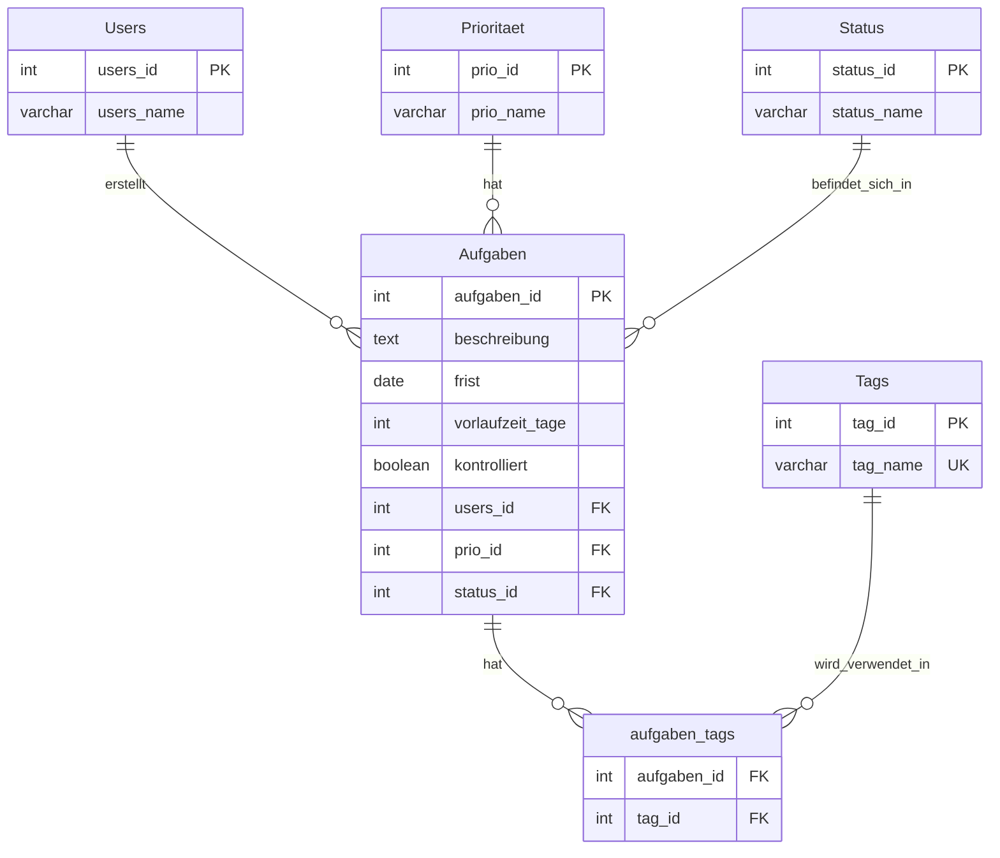

# WeekMaster

Eine moderne Web-Applikation für intelligente Aufgabenverwaltung mit Angular Frontend und Node.js Backend.

## Projektstruktur

```
WeekMaster/
├── frontend/                      # Angular Frontend (Standalone Components)
│   ├── src/
│   │   ├── app/
│   │   │   ├── app.config.ts      # Angular Anwendungs-Konfiguration
│   │   │   ├── app.css            # Globale App-Styles
│   │   │   ├── app.html           # Haupt-App-Template
│   │   │   ├── app.routes.ts      # Router-Konfiguration
│   │   │   ├── app.ts             # Haupt-App-Komponente
│   │   │   ├── footer/            # Footer-Komponente
│   │   │   ├── header/            # Header-Komponente  
│   │   │   ├── home/              # Home/Dashboard-Komponente
│   │   │   ├── nav/               # Navigations-Komponente
│   │   │   └── table/             # Aufgaben-Tabellen-Komponente
│   │   ├── environments/          # Umgebungs-Konfiguration
│   │   ├── index.html             # Haupt-HTML-Einstiegspunkt
│   │   ├── main.ts                # Anwendungs-Bootstrap
│   │   └── styles.css             # Globale CSS-Styles
│   ├── public/
│   │   └── favicon.ico
│   ├── angular.json               # Angular CLI Konfiguration
│   ├── package.json               # Frontend-Abhängigkeiten
│   ├── tsconfig.json              # TypeScript-Konfiguration
│   └── vercel.json                # Vercel-Deployment-Konfiguration
│
├── backend/                       # Node.js Backend mit Express
│   ├── routes/                    # API-Route-Handler
│   │   ├── dashboard.js           # Dashboard-Auswertungen & Statistiken
│   │   ├── index.js               # Haupt-Router-Registrierung
│   │   ├── priorities.js          # Prioritäten-Stammdaten-API
│   │   ├── status.js              # Status-Stammdaten-API
│   │   ├── tags.js                # Tag-CRUD + Suche + Autocomplete
│   │   ├── tasks.js               # Aufgaben-CRUD + Spezielle Abfragen
│   │   └── users.js               # Benutzer-Stammdaten-API
│   ├── db.js                      # PostgreSQL Datenbankverbindung
│   ├── initdb.js                  # Datenbank-Initialisierungsskript
│   ├── server.js                  # Express-Server-Setup & Middleware
│   ├── package.json               # Backend-Abhängigkeiten
│   └── vercel.json                # Vercel-Deployment-Konfiguration
│
├── docs/                          # Dokumentation und Schemas
│   ├── DATABASE-SCHEMA.sql        # Vollständige Datenbankstruktur + Daten
│   └── DEPLOYMENT.md              # Deployment-Anweisungen
│
├── package.json                   # Root-Package (concurrently-Skripte)
├── .gitignore                     # Git-Ignore-Regeln
└── README.md                      # Projekt-Dokumentation
```

## Technologie-Stack

- **Frontend**: Angular 18+ mit TypeScript (Standalone Components)
- **Backend**: Node.js mit Express
- **Datenbank**: PostgreSQL (HTW Server)
- **API**: RESTful API mit CORS-Unterstützung
- **Styling**: Tailwind CSS mit Responsive Design

## ER-Diagramm



## Datenbankdesign

Das ER-Diagramm oben zeigt die vollständige Datenbankstruktur. Noch mehr Details findest du in `docs/DATABASE-SCHEMA.sql`.

**Kernkonzepte:**
- **Intelligentes Deadline-Management**: Vorlaufzeit-System ermöglicht frühzeitige Benachrichtigungen vor der eigentlichen Frist
- **Flexibles Tag-System**: N:N Tag-Beziehungen für Aufgabenokategorien
- **Normalisierte Datenstruktur**: Separate Referenztabellen für Users, Prioritäten und Status für Datenkonsistenz
- **Dashboard-Auswertungen**: Statistische Ansichten und Prioritäten-Verteilungen

**Technische Datenbank-Features:**
- PostgreSQL mit CASCADE DELETE für referentielle Integrität
- Nullable Felder für optionale Fristen (weil nicht immer gegeben)
- UNIQUE Constraints zur Vermeidung von Doppeleinträgen
- Verknüpfungstabelle für N:N Beziehungen (aufgaben_tags)

## Datenbestand

Das System enthält ein Initialskript (`initdb.js`) mit umfangreichen Beispieldaten für eine realistische Demonstration:

- **7 Benutzer** mit verschiedenen Aufgabenprofilen
- **13 Tag-Kategorien** für Lebens- und Arbeitsbereiche (Wohnung, Familie, Studium, etc.)
- **21 Beispiel-Aufgaben** mit realistischen Fristen und Vorlaufzeiten (0-30 Tage)

Vollständige Daten und SQL-Inserts finden sich in `docs/DATABASE-SCHEMA.sql`. Zur automatischen Initialisierung nutze `node backend/initdb.js`.

## Vorlaufzeit-System

Das System implementiert ein intelligentes Deadline-Management:

```
Erinnerung = Frist - Vorlaufzeit (in Tagen)

Beispiele:
- Weihnachten planen Frist am 15.12 + 20 Tage Vorlauf = Erinnerung ab 25.11
- Praktikumsbescheinigung Frist am 15.10 + 0 Tage = Erinnerung am 15.10
- Anmeldung VGBK 30.10 + 4 Tage Vorlauf = Erinnerung ab 26.10
```

**Dashboard-Funktionen:**
- Überfällige Aufgaben zeigen
- "Diese Woche fällig" zeigen
- Erledigungsquote in Prozent (für Motivation :-D)
- Prioritäten-Verteilung (Hohe, mittlere, niedrige Prio) als Diagramm

## API Architektur

**Base URL**: `http://localhost:3000/api`

### Aufgaben (Tasks) - Vollständiges CRUD
- `GET /tasks` - Alle Aufgaben mit vollständigen Details
- `GET /tasks/urgent` - Dringende Aufgaben (nächste 7 Tage)
- `GET /tasks/user/:userId` - Aufgaben nach Benutzer mit Gesamt-Statistiken (erledigte vs. alle Aufgaben)
- `GET /tasks/tag/:tagId` - Aufgaben nach Tags gefiltert
- `POST /tasks` - Neue Aufgabe erstellen
- `PUT /tasks/:id` - Komplette Aufgabe aktualisieren
- `PATCH /tasks/:id/status` - Nur Status ändern (effizienter weil nur einzelne Änderung)
- `DELETE /tasks/:id` - Aufgabe löschen

### Tags - Vollständiges CRUD 
Hinweis: (Tag=Kategorie, also /tæg/, nicht Tag=day 🙃)
- `GET /tags` - Alle Tags mit Verwendungsstatistiken (welcher Tag wie oft)
- `GET /tags/search?q=term` - Tag-Suche mit SQL-Muster-Abgleich 
- `GET /tags/autocomplete?q=term` - Live-(Autocomplete)-Suche (max 10 Ergebnisse)
- `POST /tags` - Neuen Tag erstellen (mit Duplikat-Prüfung)
- `PUT /tags/:id` - Tag bearbeiten (mit Duplikat-Schutz)
- `DELETE /tags/:id` - Tag löschen (mit Verknüpfungstabellen-Schutz)

### Dashboard - Auswertungen & Statistiken
- `GET /dashboard/stats` - Verschiedene Statistiken
- `GET /dashboard/recent` - Kürzlich erstellte Aufgaben
- `GET /dashboard/priorities` - Prioritäten-Verteilung für Diagramme

### Referenzdaten (Stammdaten)
- `GET /users` - Alle Benutzer (für Dropdown-Listen)
- `GET /priorities` - Alle Prioritätsstufen (für Dropdown-Listen) 
- `GET /status` - Alle Status-Optionen (für Dropdown-Listen)

## Sicherheitsfeatures

**SQL-Injection Prävention:**
```javascript
// Sichere Parameterisierte Abfragen überall
const result = await client.query(
    'SELECT * FROM Aufgaben WHERE users_id = $1', 
    [userId]
);
```

**Input-Validierung:**
```javascript
// Trim und Validierung für saubere Daten
if (!beschreibung || !beschreibung.trim()) {
    return res.status(400).json({ error: 'Beschreibung ist erforderlich' });
}
```

**Referenzielle Integrität:**
```javascript
// Verknüpfungstabellen-Schutz beim Löschen
const usageCount = await client.query(
    'SELECT COUNT(*) FROM aufgaben_tags WHERE tag_id = $1', 
    [tagId]
);
```

## Entwicklungsumgebung einrichten

### Voraussetzungen
- Node.js (v18 oder höher)
- npm
- Angular CLI (v18+)
- PostgreSQL Zugang (HTW Server)
- Git

### Installation

1. Repository klonen:
```bash
git clone https://github.com/momoanoW/WeekMaster.git
cd WeekMaster
```

2. Environment-Variablen einrichten:
```bash
# In backend/ eine .env Datei erstellen:
DB_HOST=your-htw-postgres-host
DB_PORT=5432
DB_NAME=your-database
DB_USER=your-username
DB_PASSWORD=your-password
PORT=3000
```

3. Backend einrichten:
```bash
cd backend
npm install
npm start
```

4. Frontend einrichten (neues Terminal):
```bash
cd frontend
npm install
ng serve
```

## Verfügbare Skripte

### Development Workflow (Empfohlen)

### Schnellstart (Empfohlen)

```bash
# Root-Dependencies installieren (inkl. concurrently)
npm install

# Beide Services gleichzeitig starten
npm run start:all

# Installation aller Dependencies (Root + Backend + Frontend)
npm run install:all
```

**Warum `concurrently`?**
- **Ein Befehl** statt zwei separate Terminals  
- **Automatisches Cleanup** beim Stoppen (Ctrl+C stoppt beide Services)
- **Einfacher für Entwicklung** - Frontend und Backend laufen parallel

### Backend (einzeln)
- `npm run start:backend` - Startet nur das Backend (Port 3000)
- `cd backend && npm start` - Alternative: Direkter Start im backend/ Ordner

### Frontend (einzeln)  
- `npm run start:frontend` - Startet nur das Frontend (Port 4200)
- `cd frontend && ng serve` - Alternative: Direkter Start im frontend/ Ordner
- `cd frontend && ng build` - Erstellt Production Build

### Installations-Skripte
- `npm run install:backend` - Installiert nur Backend Dependencies
- `npm run install:frontend` - Installiert nur Frontend Dependencies

**URLs:**
- **Frontend**: `http://localhost:4200`  
- **Backend**: `http://localhost:3000`

## Datenbank-Setup

```bash
# Option 1: Automatische Initialisierung (empfohlen)
node backend/initdb.js

# Option 2: Manuell mit SQL-Datei
psql -h <db-host> -U <username> -d <database> -f docs/DATABASE-SCHEMA.sql
```

## Projektentwicklung

**HTW Berlin - Webtech Sommersemester 2025**  
GitHub: [@momoanoW](https://github.com/momoanoW)

## Beitragen

1. Fork des Projekts erstellen
2. Feature Branch erstellen (`git checkout -b feature/AmazingFeature`)
3. Änderungen committen (`git commit -m 'Add some AmazingFeature'`)
4. Branch pushen (`git push origin feature/AmazingFeature`)
5. Pull Request öffnen

## Lizenz

Dieses Projekt ist unter der MIT Lizenz lizenziert.
